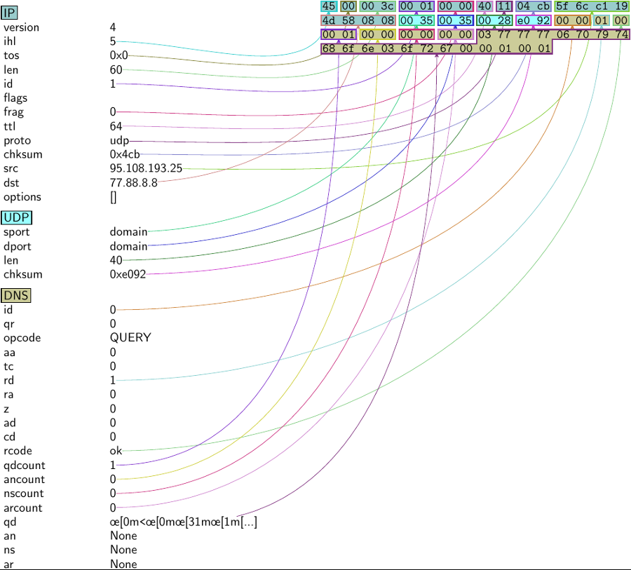

---

layout: yandex2

style: |
    /* собственные стили можно писать здесь!! */


---

# {:.logo}

## {{ site.presentation.title }}
{:.title}

### {{ site.presentation.service }}



{:.nda}


<div class="authors">

<p>{{ site.author.name }}, {{ site.author.position }}</p>



<p>{{ site.author2.name }}, {{ site.author2.position }}</p>


</div>

## Содержание

- {:.next}Мотивация
- {:.next}Что такое Scapy?
- {:.next}Примитивы Scapy
- {:.next}Немного практики
- {:.next}Бонус: BPF (и немного ассемблера)

## Можно ли работать с двоичными данными из Python?

Например, вот таким UDP-заголовком:

```c
struct udphdr {
    __be16 source;
    __be16 dest;
    __be16 len;
    __sum16 check;
};
```

## Можно ли работать с двоичными данными из Python?

Можно, но вам это не понравится:

```python
import struct
struct.pack("!HHHH", 44319, 53, 118, 0)  # '\xad\x1f\x005\x00v\x00\x00'
struct.unpack("!HHHH", x)  # (44319, 53, 118, 0)
```

## Можно ли работать с двоичными данными из Python?

```python
    return ''.join([
        struct.pack('!BBBHBB', flags, atype, length,
                    afi, safi, nexthop_len),
        '\0' * 8,
        route.nexthop,
        struct.pack('!BB', snmpa, route.mask + 88),
        struct.pack('!I', (route.label << 4) + 1)[1:],
        '\0\x01',
        route.nexthop[-4:],
        struct.pack('!H', route.label),
        prefix
    ])
```

## Нужно ли работать с двоичными данными из Python?

- {:.next}Вообще-то не обязательно
- {:.next}Но иногда даже Python-разработчику (devops'у) нужны ping, traceroute и tcpdump
- {:.next}Сети ниже HTTP 1.1 &ndash; преимущественно двоичное
- {:.next}Выполнять кодирование/декодирование вручную &ndash; боль
- {:.next}Нужен инструментарий, превращающий сетевые байты в объекты Python


## Посмотрите на Scapy!

- {:.next}Интерактивный инструмент для манипулирования сетевыми пакетами
- {:.next}А также библиотека (`from scapy import *`)
- {:.next}Позволяет создавать, парсить, отправлять и принимать практически любые пакеты
- {:.next}Поддерживает Python 2.7+ и Python 3.4+ (для Scapy 2.4.x)
- {:.next}Может заменить такие инструменты как `hping`, `trace*`, `tcpdump`
- {:.next}Дружит с IPython
- {:.next}`pip install scapy` или `pip install scapy3`

## Посмотрите на scapy!

```python
$ sudo scapy
>>> UDP(sport=44319, dport='domain', len=118)
<UDP  sport=44319 dport=domain len=118 |>
>>> import struct
>>> UDP(_pkt=struct.pack("!HHHH", 44319, 53, 118, 0))
<UDP  sport=44319 dport=domain len=118 chksum=0x0 |>
>>> _.dport
53
```

- {:.next}Протоколы вышележащих (прикладные) и нижележащих (сетевой, канальный) уровней тоже поддерживаются
- {:.next}При необходимости можно описать свой протокол: это не сложнее, чем создать класс Python

## Dive Into Scapy

- В реальной жизни протоколы &laquo;вкладываются&raquo; друг в друга: IP < UDP < DNS.
- В Scapy это выглядит столь же естественно, как и строкой выше:

```python
>>> IP(src="1.2.3.4", dst="5.6.7.8") / UDP(dport=53)
<IP  frag=0 proto=udp src=1.2.3.4 dst=5.6.7.8 |<UDP  dport=domain |>>
```
- Scapy не заменяет знание сетевых протоколов
- Характерный пример &ndash; DNS-запрос:

```python
>>>  IP(dst="77.88.8.8") / UDP(dport=53) /
     DNS(rd=1, qd=DNSQR(qname="www.python.org", qtype="A"))
<IP  frag=0 proto=udp dst=1.1.1.1 |<UDP  sport=domain dport=domain |
<DNS  rd=1 qd=<DNSQR  qname='www.python.org' qtype=A |> |>>>
```

## Несколько полезных конструкций

- {:.next}`pkt[UDP]` &ndash; возвращает соответствующий протокол (слой)
- {:.next}`pkt.haslayer(UDP)` &ndash; проверяет наличие слоя
- {:.next}`pkt.command()` &ndash; превращает пакет в команду Scapy
  - {:.next}Можно "редактировать" сетевой трафик!
- {:.next}`str(pkt)` &ndash; двоичное представление пакета
- {:.next}`repr(pkt)` &ndash; человеко-читаемое представление
- {:.next}`pkt.summary()` &ndash; основные поля
- {:.next}`pkt.show()` &ndash; детальное представление

## Пример

Запрос к Yandex DNS [https://dns.yandex.ru/](https://dns.yandex.ru/), но без DNS:

```python
>>> pkt = IP(dst="77.88.8.8") / UDP(dport=53)
>>> pkt[UDP]
<UDP  dport=domain |>
>>> pkt.haslayer(TCP)
0  # yup, not bool
>>> str(pkt)
b'E\x00\x00\x1c\x00\x01\x00\x00@\x11\x97\xbaитакдалее'
>>> pkt  # same as repr
<IP  frag=0 proto=udp dst=77.88.8.8 |<UDP  dport=domain |>>
>>> pkt.summary()
'IP / UDP 37.140.187.136:domain > 77.8.8.8:domain'
>>> pkt.show()
###[ IP ]###
  version= 4
  proto= udp
  # пропущено
```

## Не текстом единым


{:.image-left}

- `pkt.psdump()` / `pkt.pdfdump()` &ndash; визуализировать пакет в виде диаграммы PS/PDF (нужен PyX)
- {:.next}Помогает вспомнить, что значат эти 0xDEADBEEF в шестнадцатеричном дампе
- {:.next}Бывает, чуть-чуть ошибается

## Один пакет &ndash; хорошо, а range(10) лучше!

- {:.next}Бывает, что пакет нужно отправить нескольким получателям или на несколько портов
- {:.next}Scapy принимает &laquo;множественность&raquo; в соответствующих полях
- {:.next}Допустимы iterable, маски, &laquo;звездочки&raquo;
- {:.next}`IP(dst="192.168.1.0/24") / TCP(dport=[80, 443])`
- {:.next}`for p in IP(dst="192.168.1.*"): print(p.dst)` тоже работает

## Вам пакет нужен?

- {:.next}Пока пакет не покинул сетевую карту &ndash; это просто набор байтов
- {:.next}Для отправки произвольных пакетов в Linux нужен `CAP_NET_RAW` (поэтому `sudo`)
- {:.next}`sr()` &ndash; &laquo;send-receive&raquo;: отправляет запрос, получает ответ
- {:.next}Можно настраивать таймауты и повторы, выбирать интерфейс и т.п.
- {:.next}Возвращает кортеж из пар &laquo;запрос-ответ&raquo; и неотвеченных пакетов
- {:.next}Разновидности: `sr1()` (один запрос, один ответ), `srp()` (Layer 2)

## ICMP ping

```python
>>> ans, unans = sr(IP(dst="www.python.org")/ICMP()/"Pytup-2018")
Begin emission:
..Finished sending 1 packets.
.*
Received 4 packets, got 1 answers, remaining 0 packets
>>> ans, unans
(<Results: TCP:0 UDP:0 ICMP:1 Other:0>,
 <Unanswered: TCP:0 UDP:0 ICMP:0 Other:0>)
>>> ans.summary()
IP / ICMP 95.108.193.25 > 151.101.36.223 echo-request 0 / Raw ==>
IP / ICMP 151.101.36.223 > 95.108.193.25 echo-reply 0 / Raw
```

## traceroute

```python
>>> ans, unans = sr(IP(dst="www.python.org", ttl=(1, 10)) / ICMP(), timeout=2)
Begin emission:
..Finished sending 10 packets.
.*.*..**..**.*.*......................
Received 40 packets, got 8 answers, remaining 2 packets
>>> ans.summary(lambda pkt: pkt[1].src)
95.108.193.254
77.88.1.110
# пропущено
151.101.36.223
>>> traceroute("www.python.org")  # TCP traceroute made simple
Begin emission:
Finished sending 30 packets.
*****************************.
Received 30 packets, got 29 answers, remaining 1 packets
   151.101.36.223:tcp80
# пропущено
(<Traceroute: TCP:21 UDP:0 ICMP:8 Other:0>,
 <Unanswered: TCP:1 UDP:0 ICMP:0 Other:0>)
```

## Захват пакетов

- {:.next}Пакеты можно не только создавать, но и получать &laquo;из провода&raquo;
- {:.next}А также &laquo;из воздуха&raquo; или PCAP-файла
- {:.next}`sniff()` &ndash; единая точка входа для захвата трафика
- {:.next}Основные параметры: `filter` (BPF), `prn` (print function), `store` (сохранять пакеты), `count` (сколько пакетов захватить)
- {:.next}`rdpcap("somefile.pcap")` &ndash; прочитать файл и вернуть список пакетов

## Немного про Berkeley Packet Filter (BPF)

- {:.next}Виртуальная машина, предназначенная для фильтрации трафика на сокете
- {:.next}Невозможность выстрелить себе в ногу, как в Python
- {:.next}JIT-компиляция в машинный код целевой платформы
- {:.next}Высокоуровневый синтаксис, популяризированный `tcpdump`: `host`, `tcp/udp port`, логические операции
- {:.next}Не то же самое, что eBPF!


## tcpdump как компилятор
```
$ sudo tcpdump -i any -d host 77.88.8.8 and udp port 53
(000) ldh      [14]
(001) jeq      #0x800           jt 2    jf 16
(002) ld       [28]
(003) jeq      #0x4d580808      jt 6    jf 4
(004) ld       [32]
(005) jeq      #0x4d580808      jt 6    jf 16
(006) ldb      [25]
(014) jeq      #0x35            jt 15   jf 16
...
(015) ret      #262144
(016) ret      #0
```

## tcpdump

```python
>>> sniff(filter="host 77.88.8.8 and udp port 53",
    store=False, prn=lambda p: p.summary(), count=2)
IP / UDP / DNS Qry "b'www.python.org.'"
IP / UDP / DNS Ans "b'dualstack.python.map.fastly.net.'"
<Sniffed: TCP:0 UDP:0 ICMP:0 Other:0>
>>> sniff(filter="host 77.88.8.8 and udp port 53",
    store=True, prn=lambda p: p.summary(), count=2)
IP / UDP / DNS Qry "b'www.python.org.'"
IP / UDP / DNS Ans "b'dualstack.python.map.fastly.net.'"
<Sniffed: TCP:0 UDP:2 ICMP:0 Other:0>
>>> ans = _
>>> ans[1][DNS].an.rdata
b'dualstack.python.map.fastly.net.'
```

В отличие от оригинального `tcpdump`, генерирующего текст, `sniff()` работает с объектами Python!

## Итак, Scapy:

- {:.next}Расширяет области возможного применения ваших навыков Python-разработчика
- {:.next}Не избавляет от необходимости разбираться в сетях, но делает работу с ними удобнее
- {:.next}Ориентируется на интерактивный режим, но при необходимости легко встраивается в скрипты
- {:.next}Инструмент безопасности, как сетевой сканер; будьте бдительны
- {:.next}Еще больше примеров: [https://scapy.readthedocs.io/en/latest/usage.html](https://scapy.readthedocs.io/en/latest/usage.html)

## Вопросы?
{:.section}

## Контакты
{:.contacts}



<figure markdown="1">

### {{ site.author.name }}


{{ site.author.position }}


</figure>





<figure markdown="1">

### {{ site.author2.name }}


{{ site.author2.position }}


</figure>



<!-- разделитель контактов -->
-------

<!-- left -->
- {:.mail}valesini@yandex-team.ru

<!-- right -->
- {:.telegram}vsinitsyn

<!-- 

- {:.mail}author@yandex-team.ru
- {:.phone}+7-999-888-7766
- {:.github}author
- {:.bitbucket}author
- {:.twitter}@author
- {:.telegram}author
- {:.skype}author
- {:.instagram}author
- {:.facebook}author
- {:.vk}@author
- {:.ok}@author

-->
